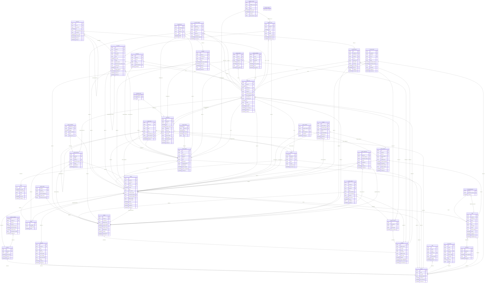

# Diagrama ER

Generado por `cargo xtask er` desde `migrations/*.sql`. No editar a mano:
la fuente de verdad del esquema son las migraciones.

```mermaid
erDiagram
    projects {
        TEXT id PK
        TEXT name
        TEXT root_path
        TEXT default_branch
        INTEGER created_at
        INTEGER last_opened_at
        INTEGER archived_at
    }
    sessions {
        TEXT id PK
        TEXT project_id FK
        TEXT status
        INTEGER daemon_pid
        INTEGER started_at
        INTEGER ended_at
    }
    worktrees {
        TEXT id PK
        TEXT project_id FK
        TEXT path
        TEXT branch
        TEXT base_ref
        TEXT head_commit
        TEXT deps_strategy
        TEXT deps_lock_hash
        TEXT status
        INTEGER created_at
        INTEGER removed_at
    }
    executor_changes {
        TEXT id PK
        TEXT agent_id FK
        TEXT from_run_id FK
        TEXT to_run_id FK
        TEXT reason
        TEXT failure_id FK
        TEXT checkpoint_id FK
        INTEGER checkpoint_age_ms
        INTEGER occurred_at
    }
    messages {
        TEXT id PK
        TEXT agent_id FK
        TEXT run_id FK
        TEXT role
        TEXT content
        TEXT content_object_id FK
        INTEGER created_at
    }
    providers {
        TEXT id PK
        TEXT display_name
        TEXT cli_name
        TEXT cli_path
        TEXT cli_version
        TEXT adapter_mode
        TEXT setup_state
        INTEGER enabled
        INTEGER hooks_supported
        INTEGER hooks_can_hold
        INTEGER last_checked_at
    }
    models {
        TEXT id PK
        TEXT provider_id FK
        TEXT cli_model_id
        TEXT display_name
        INTEGER context_window
        INTEGER supports_tools
        INTEGER supports_vision
        TEXT speed_class
        INTEGER enabled
        INTEGER discovered_at
        INTEGER last_seen_at
    }
    events {
        INTEGER id PK
        TEXT project_id FK
        TEXT agent_id FK
        TEXT run_id FK
        TEXT type
        TEXT source
        TEXT payload_json
        INTEGER occurred_at
    }
    tool_calls {
        TEXT id PK
        TEXT agent_id FK
        TEXT run_id FK
        TEXT tool_name
        TEXT command
        TEXT cwd
        INTEGER op_class
        TEXT status
        TEXT queue_reason
        TEXT blocked_by_tool_call_id FK
        TEXT enforcement
        INTEGER exit_code
        TEXT output_object_id FK
        INTEGER requested_at
        INTEGER started_at
        INTEGER finished_at
    }
    blobs {
        TEXT hash PK
        INTEGER size_bytes
        INTEGER stored_bytes
        TEXT codec
        TEXT mime
        INTEGER ref_count
        INTEGER created_at
    }
    checkpoints {
        TEXT id PK
        TEXT agent_id FK
        TEXT run_id FK
        INTEGER seq
        INTEGER trigger_event_id FK
        TEXT objective
        TEXT plan_tail
        TEXT current_step
        TEXT next_step
        TEXT head_commit
        TEXT diff_object_id FK
        TEXT summary_json
        INTEGER is_valid
        INTEGER created_at
    }
    checkpoint_refs {
        TEXT checkpoint_id FK
        TEXT object_id FK
        TEXT role
    }
    handoffs {
        TEXT id PK
        TEXT agent_id FK
        TEXT checkpoint_id FK
        TEXT to_run_id FK
        TEXT mode
        INTEGER tokens_raw_estimate
        INTEGER tokens_sent
        INTEGER build_ms
        TEXT outcome
        INTEGER created_at
    }
    provider_accounts {
        TEXT id PK
        TEXT provider_id FK
        TEXT label
        TEXT auth_status
        INTEGER last_checked_at
    }
    provider_health {
        TEXT id PK
        TEXT provider_id FK
        TEXT account_id FK
        TEXT model_id FK
        TEXT state
        TEXT quota_certainty
        REAL quota_remaining
        TEXT evidence
        INTEGER retry_after_at
        INTEGER reset_at
        REAL confidence
        INTEGER updated_at
    }
    usage_records {
        TEXT id PK
        TEXT run_id FK
        TEXT provider_id FK
        TEXT model_id FK
        INTEGER tokens_in
        INTEGER tokens_out
        TEXT source
        INTEGER recorded_at
    }
    profiles {
        TEXT id PK
        TEXT description
        TEXT weights_json
        INTEGER builtin
    }
    profile_models {
        TEXT profile_id FK
        TEXT model_id FK
        REAL base_score
        REAL learned_adjustment
        INTEGER sample_count
        REAL outcome_score_sum
    }
    routing_decisions {
        TEXT id PK
        TEXT agent_id FK
        TEXT trigger
        TEXT profile_id FK
        TEXT selected_model_id FK
        TEXT engine
        TEXT explanation
        INTEGER decided_at
    }
    routing_candidates {
        TEXT decision_id FK
        TEXT model_id FK
        INTEGER eligible
        TEXT reject_reason
        REAL score
        TEXT factors_json
    }
    agents {
        TEXT id PK
        TEXT project_id FK
        TEXT session_id FK
        TEXT task_id FK
        TEXT worktree_id FK
        INTEGER number
        TEXT state
        TEXT state_reason
        TEXT execution_mode
        TEXT requested_model_id FK
        TEXT requested_profile_id FK
        TEXT failover_policy
        TEXT context_mode
        INTEGER priority
        INTEGER created_at
        INTEGER updated_at
        INTEGER archived_at
    }
    provider_failures {
        TEXT id PK
        TEXT provider_id FK
        TEXT account_id FK
        TEXT model_id FK
        TEXT run_id FK
        TEXT failure_type
        TEXT raw_code
        TEXT message
        INTEGER retry_after_at
        INTEGER reset_at
        REAL confidence
        INTEGER occurred_at
    }
    context_objects {
        TEXT id PK
        TEXT uri
        TEXT project_id FK
        TEXT agent_id FK
        TEXT run_id FK
        TEXT kind
        TEXT blob_hash FK
        TEXT compressed_text
        TEXT compressor
        INTEGER tokens_original
        INTEGER tokens_compressed
        INTEGER created_at
    }
    context_chunks {
        INTEGER id PK
        TEXT object_id FK
        INTEGER seq
        INTEGER start_line
        INTEGER end_line
        TEXT text
    }
    handoff_items {
        TEXT id PK
        TEXT handoff_id FK
        TEXT section
        TEXT object_id FK
        TEXT path
        INTEGER fidelity
        INTEGER tokens
    }
    context_retrievals {
        TEXT id PK
        TEXT run_id FK
        TEXT object_id FK
        TEXT operation
        TEXT query
        INTEGER tokens_returned
        INTEGER found
        INTEGER requested_at
    }
    project_facts {
        TEXT id PK
        TEXT project_id FK
        TEXT key
        TEXT value
        TEXT kind
        TEXT status
        TEXT superseded_by_id FK
        TEXT source_agent_id FK
        INTEGER source_event_id FK
        INTEGER created_at
    }
    skills {
        TEXT id PK
        TEXT name
        TEXT scope
        TEXT project_id FK
        TEXT path
        TEXT content_hash
        INTEGER enabled
        INTEGER updated_at
    }
    mcp_servers {
        TEXT id PK
        TEXT name
        TEXT scope
        TEXT project_id FK
        TEXT transport
        TEXT share_mode
        TEXT command
        TEXT url
        INTEGER enabled
        TEXT status
    }
    milestones {
        TEXT id PK
        TEXT project_id FK
        TEXT name
        INTEGER requires_approval
        TEXT status
        INTEGER decided_at
    }
    task_dependencies {
        TEXT task_id FK
        TEXT depends_on_task_id FK
        INTEGER created_at
    }
    tasks {
        TEXT id PK
        TEXT project_id FK
        TEXT milestone_id FK
        TEXT code
        TEXT kind
        TEXT title
        TEXT description
        TEXT status
        TEXT status_reason
        INTEGER priority
        INTEGER created_at
        INTEGER updated_at
        INTEGER completed_at
    }
    agent_runs {
        TEXT id PK
        TEXT agent_id FK
        INTEGER seq
        TEXT provider_id FK
        TEXT account_id FK
        TEXT model_id FK
        TEXT routing_decision_id FK
        TEXT start_checkpoint_id FK
        TEXT cli_session_id
        TEXT transcript_path
        INTEGER pid
        TEXT status
        TEXT end_reason
        INTEGER exit_code
        INTEGER last_heartbeat_at
        INTEGER started_at
        INTEGER ended_at
    }
    processes {
        TEXT id PK
        TEXT run_id FK
        TEXT tool_call_id FK
        INTEGER pid
        TEXT parent_process_id FK
        TEXT command
        INTEGER peak_rss_bytes
        INTEGER cpu_time_ms
        INTEGER started_at
        INTEGER ended_at
    }
    resource_samples {
        INTEGER id PK
        TEXT session_id FK
        REAL cpu_pct
        REAL ram_pct
        INTEGER heavy_slots_used
        INTEGER heavy_slots_total
        INTEGER process_count
        TEXT performance_profile
        INTEGER sampled_at
    }
    validation_runs {
        TEXT id PK
        TEXT agent_id FK
        TEXT run_id FK
        INTEGER tier
        TEXT trigger
        TEXT status
        TEXT tool_call_id FK
        INTEGER started_at
        INTEGER finished_at
    }
    merge_requests {
        TEXT id PK
        TEXT agent_id FK
        TEXT task_id FK
        TEXT target_branch
        TEXT status
        TEXT preflight_json
        INTEGER requires_approval
        INTEGER approved_at
        INTEGER queue_position
        TEXT merge_commit
        INTEGER created_at
        INTEGER merged_at
    }
    merge_conflicts {
        TEXT id PK
        TEXT merge_request_id FK
        TEXT path
        TEXT other_agent_id FK
        TEXT resolution
        INTEGER resolved_at
    }
    reviews {
        TEXT id PK
        TEXT target_agent_id FK
        TEXT reviewer_agent_id FK
        TEXT merge_request_id FK
        TEXT status
        TEXT recommendation
        TEXT findings_json
        INTEGER created_at
        INTEGER finished_at
    }
    recovery_items {
        TEXT id PK
        TEXT project_id FK
        TEXT agent_id FK
        TEXT run_id FK
        TEXT kind
        TEXT detail
        INTEGER checkpoint_valid
        INTEGER workspace_intact
        TEXT status
        TEXT resolution
        INTEGER created_at
        INTEGER resolved_at
    }
    validation_checks {
        TEXT id PK
        TEXT validation_run_id FK
        TEXT name
        TEXT status
        INTEGER passed_count
        INTEGER failed_count
        TEXT summary
        TEXT output_object_id FK
    }
    model_suggestions {
        TEXT id PK
        TEXT agent_id FK
        TEXT current_model_id FK
        TEXT suggested_model_id FK
        TEXT reason
        REAL confidence
        TEXT status
        INTEGER created_at
        INTEGER resolved_at
    }
    learning_samples {
        TEXT run_id PK
    }
    sessions ||--|| projects : "project_id"
    worktrees ||--|| projects : "project_id"
    executor_changes ||--|| agents : "agent_id"
    executor_changes ||--|| agent_runs : "from_run_id"
    executor_changes }o--|| agent_runs : "to_run_id"
    executor_changes }o--|| provider_failures : "failure_id"
    executor_changes }o--|| checkpoints : "checkpoint_id"
    messages ||--|| agents : "agent_id"
    messages }o--|| agent_runs : "run_id"
    messages }o--|| context_objects : "content_object_id"
    models ||--|| providers : "provider_id"
    events ||--|| projects : "project_id"
    events }o--|| agents : "agent_id"
    events }o--|| agent_runs : "run_id"
    tool_calls ||--|| agents : "agent_id"
    tool_calls ||--|| agent_runs : "run_id"
    tool_calls }o--|| tool_calls : "blocked_by_tool_call_id"
    tool_calls }o--|| context_objects : "output_object_id"
    checkpoints ||--|| agents : "agent_id"
    checkpoints }o--|| agent_runs : "run_id"
    checkpoints }o--|| events : "trigger_event_id"
    checkpoints }o--|| context_objects : "diff_object_id"
    checkpoint_refs ||--|| checkpoints : "checkpoint_id"
    checkpoint_refs ||--|| context_objects : "object_id"
    handoffs ||--|| agents : "agent_id"
    handoffs }o--|| checkpoints : "checkpoint_id"
    handoffs ||--|| agent_runs : "to_run_id"
    provider_accounts ||--|| providers : "provider_id"
    provider_health ||--|| providers : "provider_id"
    provider_health }o--|| provider_accounts : "account_id"
    provider_health }o--|| models : "model_id"
    usage_records ||--|| agent_runs : "run_id"
    usage_records ||--|| providers : "provider_id"
    usage_records ||--|| models : "model_id"
    profile_models ||--|| profiles : "profile_id"
    profile_models ||--|| models : "model_id"
    routing_decisions ||--|| agents : "agent_id"
    routing_decisions }o--|| profiles : "profile_id"
    routing_decisions }o--|| models : "selected_model_id"
    routing_candidates ||--|| routing_decisions : "decision_id"
    routing_candidates ||--|| models : "model_id"
    agents ||--|| projects : "project_id"
    agents ||--|| sessions : "session_id"
    agents ||--|| tasks : "task_id"
    agents }o--|| worktrees : "worktree_id"
    agents }o--|| models : "requested_model_id"
    agents }o--|| profiles : "requested_profile_id"
    provider_failures ||--|| providers : "provider_id"
    provider_failures }o--|| provider_accounts : "account_id"
    provider_failures }o--|| models : "model_id"
    provider_failures }o--|| agent_runs : "run_id"
    context_objects ||--|| projects : "project_id"
    context_objects }o--|| agents : "agent_id"
    context_objects }o--|| agent_runs : "run_id"
    context_objects ||--|| blobs : "blob_hash"
    context_chunks ||--|| context_objects : "object_id"
    handoff_items ||--|| handoffs : "handoff_id"
    handoff_items }o--|| context_objects : "object_id"
    context_retrievals ||--|| agent_runs : "run_id"
    context_retrievals ||--|| context_objects : "object_id"
    project_facts ||--|| projects : "project_id"
    project_facts }o--|| project_facts : "superseded_by_id"
    project_facts }o--|| agents : "source_agent_id"
    project_facts }o--|| events : "source_event_id"
    skills }o--|| projects : "project_id"
    mcp_servers }o--|| projects : "project_id"
    milestones ||--|| projects : "project_id"
    task_dependencies ||--|| tasks : "task_id"
    task_dependencies ||--|| tasks : "depends_on_task_id"
    tasks ||--|| projects : "project_id"
    tasks }o--|| milestones : "milestone_id"
    agent_runs ||--|| agents : "agent_id"
    agent_runs ||--|| providers : "provider_id"
    agent_runs }o--|| provider_accounts : "account_id"
    agent_runs ||--|| models : "model_id"
    agent_runs }o--|| routing_decisions : "routing_decision_id"
    agent_runs }o--|| checkpoints : "start_checkpoint_id"
    processes ||--|| agent_runs : "run_id"
    processes }o--|| tool_calls : "tool_call_id"
    processes }o--|| processes : "parent_process_id"
    resource_samples }o--|| sessions : "session_id"
    validation_runs ||--|| agents : "agent_id"
    validation_runs }o--|| agent_runs : "run_id"
    validation_runs }o--|| tool_calls : "tool_call_id"
    merge_requests ||--|| agents : "agent_id"
    merge_requests ||--|| tasks : "task_id"
    merge_conflicts ||--|| merge_requests : "merge_request_id"
    merge_conflicts }o--|| agents : "other_agent_id"
    reviews ||--|| agents : "target_agent_id"
    reviews ||--|| agents : "reviewer_agent_id"
    reviews }o--|| merge_requests : "merge_request_id"
    recovery_items ||--|| projects : "project_id"
    recovery_items }o--|| agents : "agent_id"
    recovery_items }o--|| agent_runs : "run_id"
    validation_checks ||--|| validation_runs : "validation_run_id"
    validation_checks }o--|| context_objects : "output_object_id"
    model_suggestions ||--|| agents : "agent_id"
    model_suggestions ||--|| models : "current_model_id"
    model_suggestions ||--|| models : "suggested_model_id"
```
